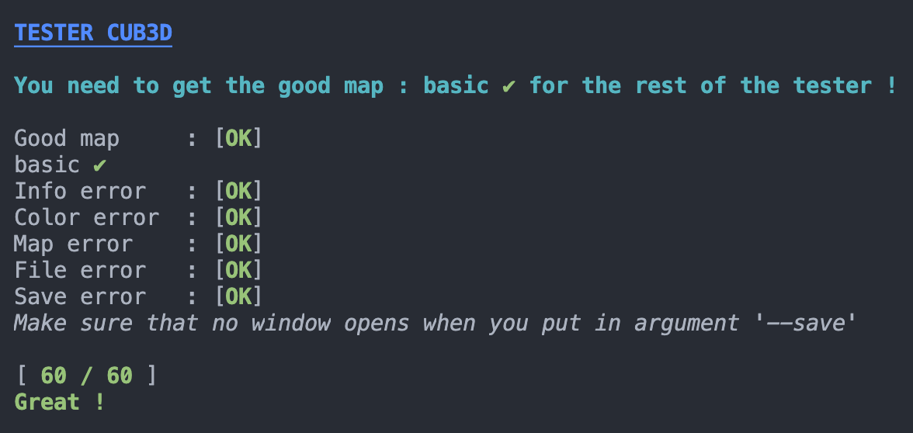

# tester_cub3d

This tester only check the ouput of cub3d.
If the program close properly "destroy window done." and if in case of an error, return "Error\n".

## USAGE

You must change the path of cub3d in the .sh and the Makefile.

Then you can excute the tester with `sh testcub3D.sh` !

Make sure you quit correctly with `ESC` or the red cross when the window opens, otherwise in any case you'll `KO`.

## SCREENSHOT

